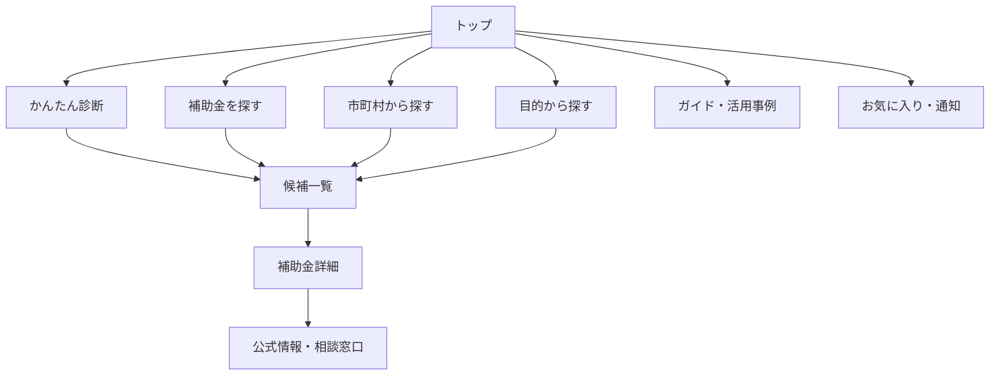
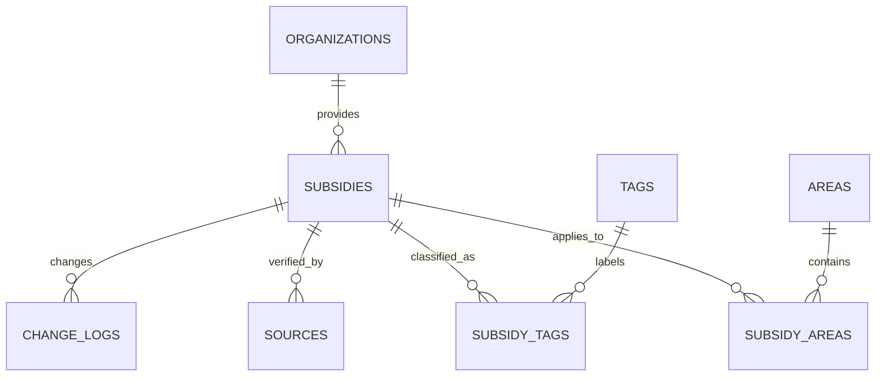
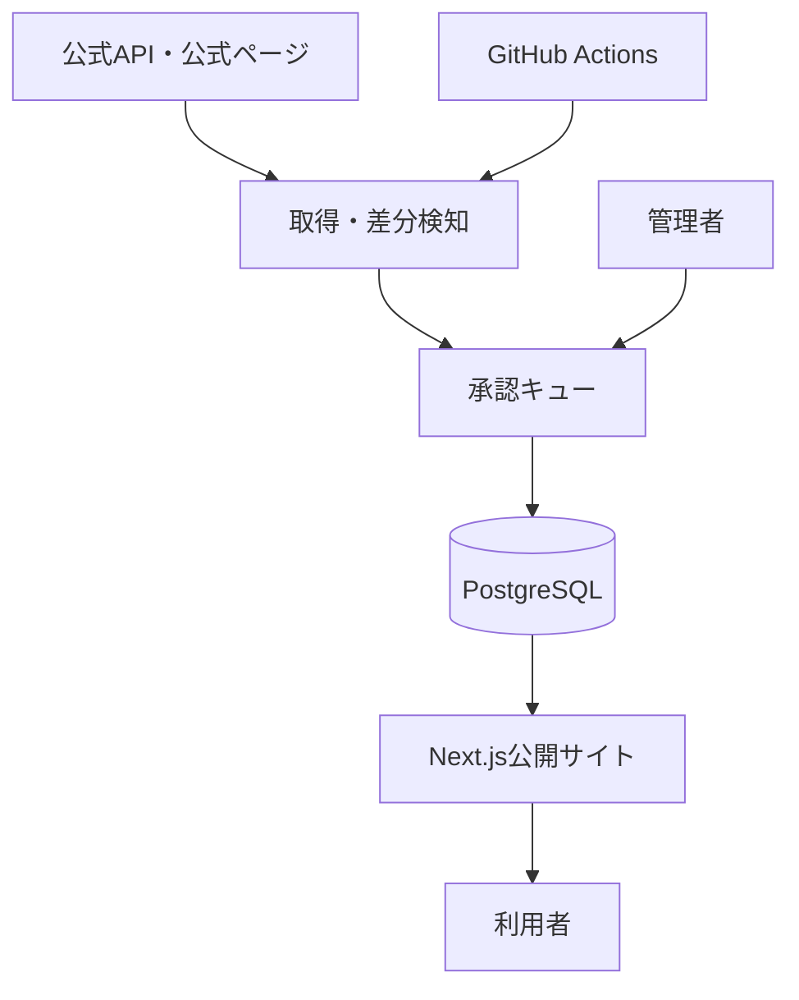

# 島根県特化型 補助金検索サイト 設計書

**仮称:** しまね補助金ナビ  
**調査・設計基準日:** 2026年8月22日  
**想定開発環境:** Claude Code / GitHub / Next.js / Supabase / Vercel  
**文書の目的:** 競合調査を踏まえ、MVPをClaude Codeで迷わず実装できるレベルまで要件・画面・データ・運用・受入基準を定義する。

---

## 1. 結論

「しまね補助金ナビ」は、全国サイトの縮小版ではなく、**島根県内19市町村の制度を、3分以内に候補化し、一次情報で確認できる地域特化型サイト**として設計する。

価値の中心は次の4点とする。

1. **島根県＋19市町村＋全国制度を横断検索**
2. **松江・出雲・石見・隠岐など、所在地から迷わず絞り込める**
3. **「何に使いたいか」から探せる、専門用語に依存しない導線**
4. **最終確認日・情報源・更新履歴を明示し、古い情報を見分けられる**

競合が強いのは「掲載量」「全国SEO」「AI診断」「専門家送客」である。一方、島根県の利用者にとって重要な「自分の市町村で本当に使えるか」「公募が現在も有効か」「どこへ相談すべきか」は、複数サイトを往復しなければ分かりにくい。この分断を解消する。

### 推奨する初期スコープ

- **MVPの主対象:** 島根県内の中小企業、個人事業主、創業予定者、農林水産・観光・地域団体
- **初期掲載:** 募集中・募集予定を優先し、100〜200制度を目標とする
- **個人・世帯向け:** 移住、住宅、省エネ、結婚・子育てをPhase 2で追加
- **申請代行:** 行わない。候補整理、公式確認、相談窓口への接続に限定する
- **AI判定:** MVPではルールベース。AIは「理由の説明」にのみ使い、採択・対象可否を断定しない

---

## 2. 調査範囲と注意点

### 2.1 比較対象

- Jグランツ
- ミラサポplus
- J-Net21 支援情報ヘッドライン
- 補助金ポータル
- スマート補助金
- 補助金コネクト
- 補助金ガイド
- 補助金サーチ
- 島根県公式サイト
- しまね産業振興財団

### 2.2 「人気・閲覧数」の扱い

各サイトの実PVは原則非公開であるため、次を分離して評価した。

- **外部推計:** Similarwebの推計値・順位・行動指標
- **サイト内公開値:** 各詳細ページに表示された閲覧数
- **代替指標:** 検索結果への露出、掲載件数、更新頻度、ページ構造、運営主体

Similarwebの数値は実測GA4ではなく推計であり、比較の目安に限定する。検索結果では、2026年6月のスマート補助金について約14.17万訪問、平均3.80ページ、平均滞在2分59秒が表示されていた。また、補助金ポータルとスマート補助金の比較では、時期により訪問数の優位が入れ替わっており、両サイトが有力な民間競合であることは確認できるが、恒常的な順位とは断定しない。

参考: [Similarweb: smart-hojokin.jp](https://www.similarweb.com/website/smart-hojokin.jp/vs/mlit.go.jp/)、[Similarweb: smart-hojokin.jp vs hojyokin-portal.jp](https://www.similarweb.com/website/smart-hojokin.jp/vs/hojyokin-portal.jp/)

---

## 3. 競合分析

| サイト | 強い点 | 主要導線 | 島根特化サイトへの示唆 |
|---|---|---|---|
| Jグランツ | 公式性、申請への接続、公開API | 条件検索→詳細→電子申請 | 基幹データとして使う。ただし利用者向け文言は簡略化する |
| ミラサポplus | 国の信頼、制度解説、事例・経営支援との接続 | 課題理解→制度探索→支援情報 | 「制度名を知らない人」の課題起点コンテンツが必要 |
| J-Net21 | 地域・業種・目的での検索、お気に入り、関連記事 | 絞り込み→一覧→詳細→公式 | 検索条件をURLに保持し、再訪しやすくする |
| 補助金ポータル | 全国網羅、地域別一覧、詳細情報、専門家相談 | SEO流入→詳細→相談 | 地域別ロングテールSEOと相談導線は有効 |
| スマート補助金 | 「2分診断」、多数の掲載情報、回遊性 | 診断→候補→相談 | 最初から複雑な検索を見せず、質問形式を用意する |
| 補助金コネクト | 所在地・制度種別・対象経費・商品から検索、AI診断 | 多段質問→候補 | 「何を買いたいか／何に使うか」は強い絞り込み軸 |
| 補助金ガイド | 地域・業種・目的・カテゴリの大量LP、閲覧数表示 | SEO LP→制度詳細→AI/専門家 | プログラマティックSEOは有効。ただし情報鮮度を最優先にする |
| 補助金サーチ | JグランツAPIを週次同期、役割と免責が明確 | 一覧→候補整理→公式確認 | 小さく始めやすい。一次情報確認をプロダクトの一部にする |
| 島根県・財団 | 一次情報、県独自制度、相談先 | 部署別ページ→PDF・様式 | 分散情報を統合し、元ページ・担当部署へ確実に戻す |

### 3.1 公開情報から確認できた具体例

- スマート補助金は年間約30,000件の支援情報と「2分診断」を訴求している。[スマート補助金](https://www.smart-hojokin.jp/)
- 補助金ガイドの島根県ページは、地域・業種・目的・カテゴリの内部リンクを大量に持ち、個別制度に閲覧数を表示している。同ページでは、小規模事業者持続化補助金1,560閲覧、IT導入補助金1,248閲覧、ものづくり補助金982閲覧と表示されていた。[補助金ガイド 島根県](https://grants-guide.com/subsidies/regions/shimane)
- 補助金コネクトは、所在地、制度種別、公募期間、対象経費、商品、キーワードを検索軸にし、診断では所在地→従業員数→業種→事業内容→購入予定→金額と質問する。[補助金コネクト 益田市](https://financeinjapan.com/finance?area=shimane&localArea=322041)
- J-Net21は、補助金・助成金・融資、セミナー等を地域・分野・業種で検索でき、お気に入り機能も提供する。[J-Net21 支援情報ヘッドライン](https://j-net21.smrj.go.jp/snavi2/)
- 島根県には8市・10町・1村の計19市町村がある。[島根県公式 市町村情報](https://www.pref.shimane.lg.jp/admin/seisaku/koho/kodomo/ichi.html)

### 3.2 競合の弱点と機会

| 課題 | 観察 | 本サイトでの対策 |
|---|---|---|
| 情報鮮度が分かりにくい | 「最新版」「募集中」と期限表示が矛盾する可能性がある | 最終確認日時、締切、状態判定、要確認ラベルを表示 |
| 地域精度が不安定 | 市町村ページで同一件数が並ぶサイトもある | 全国・県・市町村の適用範囲を別テーブルで管理 |
| 専門用語が多い | 制度名・行政用語を知らないと検索しづらい | 「設備を買いたい」「人を雇いたい」等の目的導線 |
| 公式情報が分散 | 県、財団、市町村、国で別サイト | 1件ごとに一次情報URLと相談先を整理 |
| 対象可否を誤解しやすい | AI診断や要約が断定に見える | 「候補度」「確認すべき条件」を表示し、断定しない |
| 全国サイトは地域文脈が弱い | 地域産業や相談機関との接続が薄い | 石見・出雲・隠岐、農業、観光、製造等の地域導線 |

---

## 4. プロダクトコンセプト

### 4.1 一文での価値提案

> 島根で使える補助金を、地域と目的から3分で見つけ、最新の公式情報まで迷わず確認できるサイト。

### 4.2 推奨名称

第一候補: **しまね補助金ナビ**  
タグライン: **島根で使える支援制度を、かんたんに。**

代替案:

- ご縁補助金ナビ
- しまね支援金サーチ
- しまねチャレンジ支援ナビ

「補助金」は検索意図が明確でSEO上有利だが、融資・税制・相談まで扱う段階では「支援制度ナビ」への拡張を検討する。

### 4.3 ペルソナ

1. **県内小規模事業者** — 制度名は知らないが、設備更新や販路開拓をしたい
2. **創業予定者・個人事業主** — 開業地で使える制度と相談先を知りたい
3. **農林水産・観光事業者** — 業種固有の県・市町村制度を探したい
4. **商工団体・支援者** — 相談者へ候補URLを共有したい
5. **将来対象: 県民・移住希望者** — 住宅、移住、子育て、省エネ支援を探したい

### 4.4 北極星指標

**公式情報への有効クリック数**

単なるPVではなく、「条件を絞った利用者が公式ページ・相談窓口へ進んだ回数」を価値指標にする。

---

## 5. 情報設計

### 5.1 サイトマップ



### 5.2 URL設計

| ページ | URL例 | SEO対象 |
|---|---|---|
| トップ | `/` | 島根県 補助金 |
| 検索 | `/subsidies` | 島根 補助金 一覧 |
| 詳細 | `/subsidies/[slug]` | 制度名＋令和年度＋島根 |
| 市町村 | `/areas/masuda` | 益田市 補助金 |
| 目的 | `/purposes/dx` | 島根 DX 補助金 |
| 業種 | `/industries/tourism` | 島根 観光 補助金 |
| 診断 | `/match` | 島根 補助金 診断 |
| ガイド | `/guides/[slug]` | 補助金申請・比較系検索 |
| 更新履歴 | `/updates` | 新着・変更・締切情報 |

19市町村すべてのLPを用意する。内容が薄い自動生成ページは公開せず、最低3件の制度または独自の相談窓口情報がそろった時点でindex対象にする。

### 5.3 主要検索軸

- 所在地: 全国 / 島根県 / 19市町村
- 対象: 法人 / 個人事業主 / 創業予定 / 農林水産 / NPO・団体 / 個人・世帯
- 目的: 創業、設備、IT・DX、省エネ、雇用・人材、販路、商品開発、事業承継、観光、移住、住宅
- 業種: 製造、建設、小売、飲食、宿泊・観光、IT、医療福祉、教育、農林水産、その他
- 対象経費: 機械設備、Web・広告、ソフトウェア、人件費、研修、改修、車両、専門家費用等
- 状態: 募集中 / 募集予定 / 随時 / 締切間近 / 終了
- 金額: 上限金額レンジ
- 締切: 7日以内 / 30日以内 / 60日以内

---

## 6. 画面仕様

### 6.1 トップページ

**ファーストビュー**

- H1: 「島根で使える補助金を、3分で。」
- 所在地セレクト: 市町村を選ぶ
- 目的チップ: 設備 / IT・DX / 雇用 / 販路 / 創業 / 省エネ
- CTA: 「条件から探す」「かんたん診断」
- 信頼表示: 掲載件数、募集中件数、最終更新日時

**続くセクション**

1. 締切が近い制度
2. 新着・更新された制度
3. 市町村から探す
4. 目的から探す
5. 島根県の相談窓口
6. 初めての方向けガイド

### 6.2 検索一覧

**デスクトップ:** 左フィルター＋右カード一覧  
**モバイル:** 上部固定の「絞り込み」ボタン＋ボトムシート

カード必須項目:

- 制度名
- 募集中 / 募集予定 / 終了 / 要確認
- 対象地域
- 対象者
- 上限額・補助率
- 締切と残日数
- 目的タグ
- 実施機関
- 最終確認日
- お気に入り

並び順:

1. おすすめ順
2. 締切が近い順
3. 更新が新しい順
4. 上限額が高い順

### 6.3 かんたん診断

登録不要で、次の6問に回答する。

1. 事業所・活動場所の市町村
2. 法人、個人事業主、創業予定、団体等
3. 業種
4. 実現したいこと
5. 従業員規模
6. 予定経費・予算規模

結果は「対象の可能性が高い」「条件確認が必要」「対象外条件あり」の3段階とし、各候補に**一致した理由**と**確認が必要な条件**を表示する。

### 6.4 詳細ページ

上から順に表示する。

1. 状態、制度名、実施機関
2. 一言要約
3. 上限額、補助率、締切、対象地域
4. 「あなたとの一致点」
5. 対象者・対象事業・対象経費
6. 対象外・注意条件
7. 申請の流れ
8. 必要書類
9. 相談窓口
10. 公式ページ・公募要領へのCTA
11. 更新履歴と最終確認日時
12. 関連制度

固定免責:

> 本ページは制度選びの参考情報です。対象可否や最新条件は、必ず実施機関の公式ページ・公募要領でご確認ください。

### 6.5 管理画面

- 取り込み候補一覧
- 新規 / 更新 / 重複 / 終了候補の差分表示
- 一次情報URL・取得日時・HTTP状態の確認
- 公開 / 保留 / 却下
- 内容編集とプレビュー
- 市町村・業種・目的タグ付け
- 期限超過・30日未確認アラート
- 変更履歴、担当者、承認者

---

## 7. 機能要件

### 7.1 MVP必須

| ID | 機能 | 優先度 | 受入条件 |
|---|---|---:|---|
| F-01 | キーワード検索 | Must | 2文字以上で制度名・要約・実施機関を検索できる |
| F-02 | 複合絞り込み | Must | 市町村・目的・対象者・状態を同時指定でき、URL共有できる |
| F-03 | 詳細表示 | Must | 金額、率、締切、対象、出典、確認日を表示する |
| F-04 | かんたん診断 | Must | 6問以内、登録不要、理由付き上位10件を返す |
| F-05 | 公式確認CTA | Must | すべての公開制度に一次情報URLがある |
| F-06 | お気に入り | Must | 未ログインでも端末内保存できる |
| F-07 | 締切表示 | Must | JSTで残日数を計算し、終了後は自動で状態を変える |
| F-08 | 管理承認 | Must | 自動取得データは承認前に一般公開されない |
| F-09 | 更新履歴 | Must | 重要項目の変更日と変更内容を表示できる |
| F-10 | SEO | Must | 詳細・地域・目的ページに固有title、description、canonicalを出す |

### 7.2 Phase 2

- メール / LINE通知
- ユーザー登録・事業者プロフィール
- 複数制度の比較表
- 申請準備チェックリスト
- 相談予約・専門家紹介
- 個人・世帯向け制度
- 採択事例・地域事例
- AIによる平易な要約と質問応答

### 7.3 非機能要件

- モバイルファースト
- Core Web Vitalsを意識し、LCP 2.5秒以内を目標
- WCAG 2.2 AA相当
- 検索結果は通常1秒以内、P95で2秒以内
- 公開ページ可用性99.5%以上を目標
- 管理操作とデータ更新を監査ログへ保存
- 個人情報は必要最小限。診断だけなら保存しない
- 日本時間で締切を処理する

---

## 8. データ取得・更新設計

### 8.1 情報源の優先順位

1. 実施機関の公式ページ・公募要領
2. Jグランツ公開API
3. 島根県・19市町村・しまね産業振興財団等の公式情報
4. J-Net21等の公的支援機関
5. 民間ポータルは発見・比較の参考に限定

デジタル庁は、補助金一覧取得APIと詳細取得APIを公開している。一覧APIは `GET /v1/public/subsidies`、詳細APIは `GET /v1/public/subsidies/id/{id}` として公開され、対象地域、上限額、受付期間、対象従業員数などを取得できる。[デジタル庁 JグランツAPI](https://developers.digital.go.jp/documents/jgrants/api/)

しまね産業振興財団は県内事業者向け助成金を独自に掲載しているため、Jグランツだけでは地域制度を網羅できない。[しまね産業振興財団 募集中補助金](https://www.joho-shimane.or.jp/news/wanted_subsidy/)

### 8.2 取得方式

| 情報源 | 方式 | 頻度 | 公開条件 |
|---|---|---:|---|
| Jグランツ | 公式API | 毎日 | 自動整形後、初回のみ承認。重要差分は再承認 |
| 島根県・財団 | 公式ページ監視 | 毎日 | 新規・変更を管理画面で確認後公開 |
| 19市町村 | ページ一覧・RSS・手動登録 | 1〜3日 | 人手確認後公開 |
| PDF公募要領 | URL・メタ情報保存 | 変更検知時 | 要約は人手確認後公開 |

### 8.3 安全な取得方針

- robots.txt、利用規約、著作権表示を確認する
- ページ全文を転載せず、必要最小限の事実を要約する
- 取得間隔を抑え、ETag / Last-Modified / 本文ハッシュを活用する
- アクセス不能なサイトは自動回避せず、手動登録へ切り替える
- PDFやHTML内の命令文をシステム指示として扱わない
- 一次情報URLを必須にし、出典不明データを公開しない

### 8.4 更新状態

- `verified`: 30日以内に公式確認済み
- `needs_review`: 公式ページ変更または確認から31日以上
- `source_unavailable`: 一次情報へアクセス不能
- `expired`: 締切超過
- `archived`: 掲載終了、SEO上有用な場合のみ保存

締切前7日、公式URLの404、補助額・期限・対象地域の変更は重要イベントとして扱う。

---

## 9. データベース設計

### 9.1 主要テーブル



### 9.2 `subsidies`

| カラム | 型 | 説明 |
|---|---|---|
| id | uuid | 内部ID |
| external_id | text nullable | Jグランツ等の外部ID |
| slug | text unique | SEO URL |
| title | text | 制度名 |
| summary | text | 平易な要約 |
| status | enum | draft / scheduled / open / anytime / closed / needs_review |
| applicant_types | text[] | 法人、個人事業主等 |
| industries | text[] | 業種 |
| purposes | text[] | 目的 |
| eligible_expenses | text[] | 対象経費 |
| subsidy_rate_text | text | 補助率原文要約 |
| max_amount_yen | bigint nullable | 上限額 |
| min_amount_yen | bigint nullable | 下限額 |
| application_start_at | timestamptz nullable | 受付開始 |
| application_end_at | timestamptz nullable | 受付終了 |
| official_url | text | 一次情報URL |
| guideline_url | text nullable | 公募要領URL |
| contact_text | text nullable | 相談窓口 |
| verified_at | timestamptz | 最終確認日時 |
| published_at | timestamptz nullable | 公開日時 |
| content_hash | text | 差分検知 |
| search_vector | tsvector | 全文検索 |

### 9.3 その他

- `areas`: 全国、島根県、19市町村、地域区分
- `subsidy_areas`: 制度と対象地域の多対多
- `organizations`: 実施機関・相談窓口
- `sources`: URL、取得日時、HTTP状態、ハッシュ、公式性
- `tags` / `subsidy_tags`: 目的・対象経費・テーマ
- `change_logs`: 項目、旧値、新値、変更元、承認者
- `ingestion_runs`: 取得ジョブ結果・件数・エラー
- `profiles`: Phase 2の事業者プロフィール
- `favorites`: Phase 2のサーバー保存
- `notification_rules`: Phase 2の通知条件
- `audit_logs`: 管理操作

重複判定キーは、外部IDを第一優先とし、なければ「正規化制度名＋実施機関＋年度＋対象地域」の類似度で候補を出し、人が確定する。

---

## 10. マッチングロジック

MVPは説明可能なスコアリングにする。

| 条件 | 点数 |
|---|---:|
| 対象市町村が一致 | +30 |
| 対象者区分が一致 | +20 |
| 目的が一致 | +20 |
| 業種が一致 | +15 |
| 従業員規模が一致 | +10 |
| 予定経費が一致 | +10 |
| 募集中 | +10 |
| 30日以内に確認済み | +5 |
| 明確な対象外条件 | 候補から除外 |
| 要確認状態 | -20 |

100点に丸めるのではなく、「一致理由」をそのまま表示する。条件が構造化できない制度は、スコアを低くするのではなく「要件を公式ページで確認」と明示する。

AIを追加する場合も、候補抽出はDB条件で行い、Claude APIには抽出済み制度と利用者入力だけを渡して説明文を生成させる。AIに存在しない制度や条件を生成させない。

---

## 11. 技術設計

### 11.1 推奨構成

| レイヤー | 採用案 | 理由 |
|---|---|---|
| フロント / API | Next.js App Router + TypeScript | SEO、SSR/ISR、同一リポジトリで開発しやすい |
| UI | Tailwind CSS + shadcn/ui | Claude Codeで一貫した実装をしやすい |
| DB / 認証 | Supabase PostgreSQL | 無料枠でMVP、RLS、管理画面認証 |
| 検索 | PostgreSQL FTS + `pg_trgm` | 初期費用不要。規模拡大時にTypesense等へ移行可能 |
| ホスティング | Vercel | Next.jsとの親和性、プレビュー環境 |
| 定期処理 | GitHub Actions + Route Handler | 毎日同期、ログをGitHubとDBに残せる |
| メール | Resend（Phase 2） | 締切通知 |
| 分析 | GA4 + Search Console | SEOと公式クリックを計測 |
| エラー監視 | Sentry | 取得失敗・画面エラー |

### 11.2 アーキテクチャ



### 11.3 リポジトリ構成

```text
app/
  (public)/
    page.tsx
    subsidies/
    areas/[slug]/
    purposes/[slug]/
    industries/[slug]/
    match/
    guides/[slug]/
  admin/
  api/
components/
  search/
  subsidy/
  diagnosis/
  admin/
lib/
  db/
  search/
  matching/
  ingestion/
  validation/
  seo/
supabase/
  migrations/
  seed.sql
scripts/
  sync-jgrants.ts
  check-sources.ts
tests/
  unit/
  integration/
  e2e/
docs/
  data-policy.md
  operations.md
```

### 11.4 セキュリティ

- 管理画面はSupabase Auth＋管理者ロール
- RLSを全公開テーブルに設定し、下書きは公開APIから取得不能にする
- 外部HTMLはサニタイズし、そのまま描画しない
- SSRF対策として取得先ドメインを許可リスト化
- URL、日付、金額、HTMLをスキーマ検証する
- API・診断にレート制限
- Secretsは環境変数、`.env`をGit管理しない
- 管理更新は監査ログへ記録
- AI入力に個人情報を含めず、出力を最終判断に使わない

---

## 12. SEO・集客設計

### 12.1 最初に作る検索テーマ

1. `島根県 補助金`
2. `[市町村名] 補助金`
3. `島根県 創業 補助金`
4. `島根県 IT導入 DX 補助金`
5. `島根県 設備投資 補助金`
6. `島根県 観光 宿泊 補助金`
7. `島根県 農業 補助金`
8. `島根県 省エネ 補助金`
9. `島根県 販路開拓 補助金`
10. `島根県 雇用 助成金`

### 12.2 SEO実装

- 制度詳細に `GovernmentService` または適切な構造化データを検討し、誤った型は使わない
- パンくず、FAQ、更新日、実施機関、受付期間を明示
- URLパラメータ検索は原則noindex、地域・目的LPをcanonicalとする
- 終了制度は削除せず、年度更新先または関連制度を案内
- 市町村LPに相談窓口・地域固有説明・新着制度を掲載
- XML sitemapを詳細・地域・目的・ガイドに分割
- 変更時に `lastmod` を更新
- OGP画像は市町村・目的別にテンプレート生成

### 12.3 コンテンツ計画

- 「島根県で補助金を探す最短手順」
- 「補助金・助成金・融資の違い」
- 「益田市で創業するときの相談先」
- 「IT導入・Web制作に使える支援制度」
- 「申請前に準備する書類一覧」
- 「締切後に次回公募へ備える方法」

制度データだけでなく、**地域の相談先・実際の活用方法・年度更新**を組み合わせて、全国ポータルとの差をつくる。

---

## 13. 収益化案

無料の検索体験を損なわない順に導入する。

1. **専門家・支援機関への相談送客** — 広告・提携であることを明示
2. **自治体・商工団体向け埋め込み検索 / ホワイトラベル**
3. **事業者向け締切通知・比較・申請準備の有料プラン**
4. **地域金融機関・士業向けダッシュボード**
5. **スポンサー枠** — 検索順位とは分離し「広告」と表示

補助金情報そのものは無料とし、有料化は通知、整理、相談、業務効率化に限定する。

---

## 14. KPI

### 14.1 90日目標（提案値）

| 指標 | 目標 |
|---|---:|
| 公開制度数 | 150件 |
| 19市町村LP公開率 | 100% |
| 30日以内に確認済みの公開制度 | 90%以上 |
| 月間オーガニックセッション | 5,000 |
| 検索・診断完了率 | 35%以上 |
| 公式情報クリック率 | 20%以上 |
| 404・出典切れ | 1%未満 |
| 公式クリック計測欠損 | 2%未満 |

これは市場実績ではなく、MVPの運用目標である。公開後4週間の実測を基に見直す。

---

## 15. 開発ロードマップ

### Sprint 0: 基盤（2〜3日）

- Next.js、TypeScript、Tailwind、Supabase初期化
- lint、format、test、CI
- DBマイグレーション
- デザイン・文言トークン

### Sprint 1: 検索MVP（5日）

- トップ、一覧、詳細
- 複合フィルター、URL同期
- 19市町村・目的LP
- サンプルデータ30件

### Sprint 2: データ同期と管理（5日）

- Jグランツ同期
- 差分検知、重複候補
- 承認キュー、更新履歴
- 期限自動判定、出典監視

### Sprint 3: 診断・品質（4日）

- 6問診断、説明可能スコア
- お気に入り
- SEO、構造化データ、サイトマップ
- E2E、アクセシビリティ、性能確認

### Sprint 4: 公開準備（2〜3日）

- 公式データ100〜150件を確認
- 利用規約、プライバシー、免責、データ方針
- Analytics、Search Console、Sentry
- 運用手順、バックアップ、公開判定

**合計目安:** 18〜20稼働日。1人＋Claude Codeで、まず検索・詳細・診断・管理を完成させる前提。

---

## 16. テスト・受入基準

### 16.1 自動テスト

- Unit: 締切状態、金額表示、地域適用、スコア計算、重複正規化
- Integration: DB検索、RLS、Jグランツ変換、承認フロー
- E2E: トップ→絞り込み→詳細→公式クリック、診断→候補、管理承認
- Accessibility: axeで主要ページに重大違反0件
- Security: 未認証ユーザーが下書き・管理APIへアクセスできない

### 16.2 リリース受入条件

- 公開制度の100%に一次情報URL、実施機関、最終確認日時がある
- 19市町村すべてを選択でき、地域外制度が誤表示されない
- 期限超過制度は翌日までに「終了」へ変わる
- 診断結果の全候補に一致理由または要確認理由がある
- 404の公式URLを一般公開のおすすめ上位に出さない
- スマートフォン幅375pxで主要フローを完了できる
- title、description、canonical、OGP、sitemap、robotsが正しい
- CIでtypecheck、lint、unit、integration、E2Eが成功する

---

## 17. Claude Code実装ルール

リポジトリ直下の `CLAUDE.md` に次を記載する。

```md
# Project Rules

## Goal
島根県内の利用者が、3分以内に使える可能性のある補助金を見つけ、
必ず公式情報へ到達できるサイトを作る。

## Non-negotiables
- 公開制度には official_url と verified_at を必須とする
- AIで対象可否・採択可能性を断定しない
- 外部HTMLを dangerouslySetInnerHTML で直接表示しない
- 取得データはZodで検証する
- 下書きは公開クエリから除外し、RLSでも保護する
- 金額は整数の円、日時はDBでUTC、表示はAsia/Tokyo
- 変更にはテストを追加し、既存テストを通す
- 要件外の課金・外部送信・本番デプロイは行わない

## Definition of Done
- typecheck / lint / test / build が成功
- モバイルとデスクトップを確認
- loading / empty / error 状態を実装
- アクセシビリティ上の重大違反がない
- docs と migration が実装に一致
```

### 最初にClaude Codeへ渡す指示文

```text
添付の「島根県特化型 補助金検索サイト 設計書」を正として、
Sprint 0とSprint 1を実装してください。

進め方:
1. 現在のリポジトリを調査し、実装計画と変更対象を提示する。
2. Next.js App Router + TypeScript + Tailwind + Supabaseで構築する。
3. DB migration、型、サンプル30件、トップ、検索一覧、詳細、
   市町村LP、目的LPを実装する。
4. 検索条件はURLへ同期し、SSR可能なページはSSRする。
5. loading、empty、error、404を含める。
6. unit / integration / E2Eを追加する。
7. typecheck、lint、test、buildを実行し、失敗があれば修正する。
8. 完了時に、変更ファイル、確認結果、未実装、次Sprintを報告する。

不明点は、後戻り不能・外部課金・セキュリティに関わるものだけ質問し、
それ以外は設計書の目的に沿った妥当な前提を明示して進めてください。
本番デプロイや外部へのデータ送信は行わないでください。
```

### Claude Codeでの実装順

1. スキーマと型を先に固定
2. サンプルデータで公開UIを完成
3. 検索・地域判定を自動テスト
4. Jグランツ同期を追加
5. 管理承認を追加
6. 実データを投入
7. SEO・性能・アクセシビリティを最終確認

---

## 18. 運用設計

### 毎日

- 自動同期結果と失敗件数を確認
- 7日以内に締切の制度を確認
- 公式URLの404・リダイレクトを確認

### 毎週

- 19市町村と県・財団の新着確認
- 重要差分を承認
- Search Consoleの検索語からLP改善
- 人気制度の公式情報を再確認

### 毎月

- 31日以上未確認の制度を棚卸し
- 終了制度をアーカイブし、次年度ページへ接続
- 市町村別の情報欠落を確認
- 公式クリック率、検索ゼロ件語、診断離脱をレビュー

### 公開責任

- 自動取得 = 発見と差分検知
- 人間 = 公開承認と要約の責任
- 公式情報 = 最終判断

---

## 19. リスクと対策

| リスク | 影響 | 対策 |
|---|---|---|
| 古い制度を募集中表示 | 信用低下、申請機会損失 | 締切自動判定、30日確認、差分監視 |
| 対象地域の誤判定 | 不適切な候補 | 地域を多対多で構造化し、全国・県・市町村を分離 |
| 自動要約の誤り | 誤認 | 重要項目は構造化抽出＋人手承認 |
| スクレイピング制約 | 更新停止 | 公式API優先、許可範囲確認、手動登録経路 |
| SEO用の薄いページ | 検索評価低下 | 固有制度・相談先・更新情報がないLPはnoindex |
| AI診断への過信 | 法務・信用リスク | 候補提示に限定、理由・未確認条件・免責を表示 |
| 専門家広告の中立性 | 信頼低下 | 広告表示、検索順位と分離、選定基準公開 |
| 無料枠上限 | 性能低下 | ISR、DB索引、キャッシュ、利用量監視 |

---

## 20. 最終提案

最初から大量掲載や高度な生成AIを狙うより、次の順で勝つべきである。

1. **島根の制度が正確に見つかる**
2. **市町村と目的で簡単に絞れる**
3. **いつ確認された情報か分かる**
4. **公式ページ・地域の相談先へ確実につながる**
5. その後に通知、AI説明、専門家相談を追加する

差別化の中心はAIではなく、**地域データの品質、更新責任、相談先との接続**である。Claude Codeは開発速度を上げるために使い、制度の正しさを保証する主体にはしない。

---

## 21. 主な参照先

- [デジタル庁 JグランツAPIドキュメント](https://developers.digital.go.jp/documents/jgrants/api/)
- [ミラサポplus](https://mirasapo-plus.go.jp/)
- [J-Net21 支援情報ヘッドライン](https://j-net21.smrj.go.jp/snavi2/)
- [補助金ポータル](https://hojyokin-portal.jp/)
- [スマート補助金](https://www.smart-hojokin.jp/)
- [補助金コネクト 島根県益田市](https://financeinjapan.com/finance?area=shimane&localArea=322041)
- [補助金ガイド 島根県](https://grants-guide.com/subsidies/regions/shimane)
- [補助金サーチ](https://hojokin-search.com/)
- [島根県公式サイト](https://www.pref.shimane.lg.jp/)
- [島根県 市町村リンク](https://www.pref.shimane.lg.jp/link01.html)
- [しまね産業振興財団 助成金サポート](https://www.joho-shimane.or.jp/solution/subsidy/)
- [しまね産業振興財団 募集中補助金](https://www.joho-shimane.or.jp/news/wanted_subsidy/)
- [Similarweb: smart-hojokin.jp](https://www.similarweb.com/website/smart-hojokin.jp/vs/mlit.go.jp/)
- [Similarweb: smart-hojokin.jp vs hojyokin-portal.jp](https://www.similarweb.com/website/smart-hojokin.jp/vs/hojyokin-portal.jp/)

